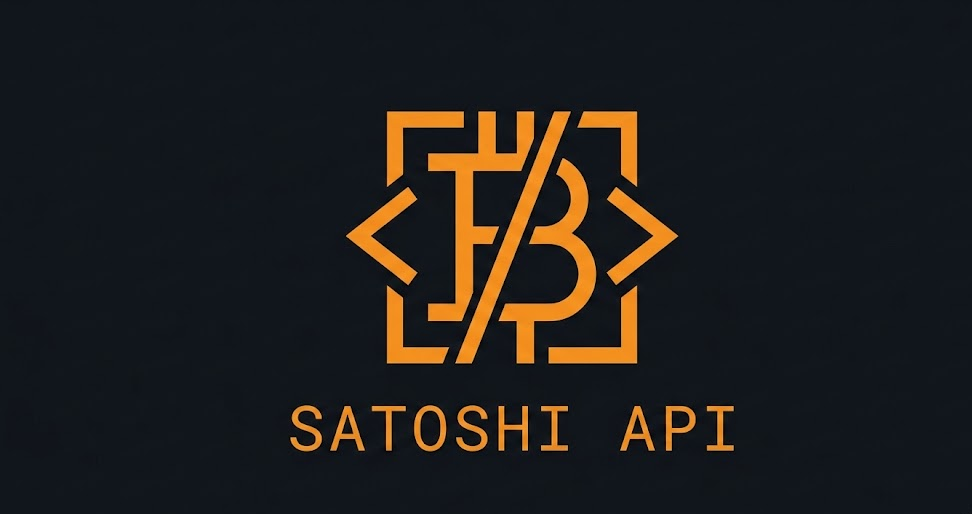

<div align="center">



# Satoshi API

**Stop overpaying Bitcoin fees. Know when to send.**

[](https://github.com/Bortlesboat/bitcoin-api/actions/workflows/ci.yml)
[](https://pypi.org/project/satoshi-api/)
[](https://pypi.org/project/satoshi-api/)
[](https://www.python.org/downloads/)
[](LICENSE)
[](https://bitcoinsapi.com)

[Live Playground](https://bitcoinsapi.com/docs) &middot; [Landing Page](https://bitcoinsapi.com) &middot; [PyPI](https://pypi.org/project/satoshi-api/) &middot; [MCP Server](https://github.com/Bortlesboat/bitcoin-mcp) &middot; [Discord Bot](https://github.com/Bortlesboat/satoshi-discord-bot)

</div>

---

Bad fee timing burns sats on every Bitcoin transaction. Satoshi API tells you when to send, what to pay, and whether to wait — combining multiple `estimatesmartfee` targets with real-time mempool state. Instead of just "4 sat/vB", you get "Fees are low. Good time to send." One `pip install`, self-hostable, open source.

## Install & Run

```bash
pip install satoshi-api
export BITCOIN_RPC_USER=your_user BITCOIN_RPC_PASSWORD=your_password
satoshi-api
# API:  http://localhost:9332
# Docs: http://localhost:9332/docs
```

## Example

```bash
curl http://localhost:9332/api/v1/fees/recommended | jq
```

```json
{
  "data": {
    "recommendation": "Fees are low. Good time to send.",
    "estimates": { "high": 4, "medium": 2, "low": 1 }
  },
  "meta": { "timestamp": "...", "node_height": 939462, "chain": "main" }
}
```

## Core Endpoints

| Category | Endpoints | Highlights |
|----------|-----------|------------|
| **Blocks** | 8 | Latest block, by height/hash, stats, txids, header |
| **Transactions** | 7 | Decoded analysis, status, outspends, UTXO lookup, broadcast |
| **Fees** | 7 | Recommendations, landscape ("send now or wait?"), history, mempool-blocks |
| **Mempool** | 5 | Congestion score, fee buckets, recent entries |
| **Mining** | 2 | Hashrate, difficulty, next block template |
| **Network** | 4 | Peers, forks, difficulty, address validation |
| **Streams** | 2 | Real-time blocks & fees via SSE |

...and more (prices, address lookups, exchange comparison). [Full interactive docs at `/docs`](https://bitcoinsapi.com/docs).

## For AI Agents

**[bitcoin-mcp](https://github.com/Bortlesboat/bitcoin-mcp)** — the first Bitcoin MCP server on the official Anthropic MCP Registry — lets AI agents check fees, verify payments, and monitor addresses without human babysitting. Saves developer time: no custom Bitcoin plumbing needed.

```bash
# Install and point at your Satoshi API instance
pip install bitcoin-mcp
SATOSHI_API_URL=https://bitcoinsapi.com bitcoin-mcp
```

Or connect to a local node directly:

```json
{
  "mcpServers": {
    "bitcoin": { "command": "bitcoin-mcp" }
  }
}
```

## Self-Hosting

```bash
pip install satoshi-api
satoshi-api  # runs on :9332

# Expose publicly (free HTTPS + DDoS protection)
cloudflared tunnel --url http://localhost:9332
```

See [self-hosting guide](docs/self-hosting.md) for full production setup.

## Contributing

Issues and PRs welcome. Run the test suite before submitting:

```bash
pip install -e ".[dev]"
pytest
```

## License

Apache 2.0 — see [LICENSE](LICENSE).

---

<div align="center">

**[Live API](https://bitcoinsapi.com/docs)** &middot; **[Website](https://bitcoinsapi.com)** &middot; **[PyPI](https://pypi.org/project/satoshi-api/)** &middot; **[MCP Server](https://github.com/Bortlesboat/bitcoin-mcp)**

Built by a [Bitcoin Core contributor](https://github.com/Bortlesboat).

</div>
