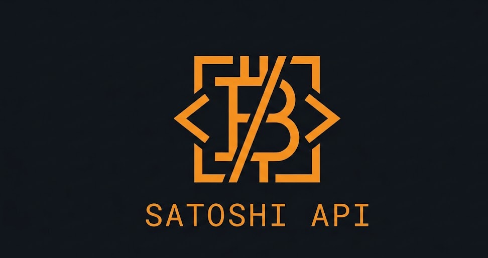

<div align="center">



# Satoshi API

**Stop overpaying Bitcoin fees. Know when to send.**

[](https://github.com/Bortlesboat/bitcoin-api/actions/workflows/ci.yml)
[](https://pypi.org/project/satoshi-api/)
[](https://pypi.org/project/satoshi-api/)
[](https://www.python.org/downloads/)
[](LICENSE)

[](https://opensats.org)

[Self-Hosting](#self-hosting) &middot; [PyPI](https://pypi.org/project/satoshi-api/) &middot; [MCP Server](https://github.com/Bortlesboat/bitcoin-mcp) &middot; [Discord Bot](https://github.com/Bortlesboat/satoshi-discord-bot)

</div>

---

<div align="center">

**Self-hostable** &middot; **MCP-ready** &middot; **x402-capable** &middot; **Apache 2.0**

</div>

---

Bad fee timing burns sats on every Bitcoin transaction. Satoshi API tells you when to send, what to pay, and whether to wait — combining multiple `estimatesmartfee` targets with real-time mempool state. Instead of just "4 sat/vB", you get "Fees are low. Good time to send." One `pip install`, self-hostable, open source.

> [!IMPORTANT]
> The project-operated `bitcoinsapi.com` demo and x402 facilitator are intentionally paused during an infrastructure review. The open-source package remains available for self-hosting; do not rely on the hosted URLs until this notice is removed.

## Install & Run

```bash
pip install satoshi-api
export BITCOIN_RPC_USER=your_user BITCOIN_RPC_PASSWORD=your_password
satoshi-api
# API:  http://localhost:9332
# Docs: http://localhost:9332/docs
```

## Example

```bash
curl http://localhost:9332/api/v1/fees/recommended | jq
```

```json
{
  "data": {
    "recommendation": "Fees are low. Good time to send.",
    "estimates": { "high": 4, "medium": 2, "low": 1 }
  },
  "meta": { "timestamp": "...", "node_height": 939462, "chain": "main" }
}
```

## Core Endpoints

| Category | Example paths | Highlights |
|----------|---------------|------------|
| **Fees** | `/api/v1/fees/recommended`, `/api/v1/fees/plan` | Recommendations, landscape ("send now or wait?"), history, mempool-blocks |
| **Transactions** | `/api/v1/tx/{txid}`, `/api/v1/broadcast` | Decoded analysis, status, outspends, UTXO lookup, broadcast |
| **Mempool** | `/api/v1/mempool`, `/api/v1/mempool/recent` | Congestion score, fee buckets, recent entries |
| **Blocks** | `/api/v1/blocks/latest`, `/api/v1/blocks/{height_or_hash}` | Latest block, by height/hash, stats, txids, header |
| **Mining** | `/api/v1/mining`, `/api/v1/mining/nextblock` | Hashrate, difficulty, next block template |
| **Network** | `/api/v1/network`, `/api/v1/network/difficulty` | Peers, forks, difficulty, address validation |
| **Streams** | `/api/v1/stream/blocks`, `/api/v1/stream/fees` | Real-time blocks & fees via SSE |

...and more (prices, address lookups, exchange comparison). A self-hosted instance serves its interactive docs at `/docs`.

## For AI Agents

**[bitcoin-mcp](https://github.com/Bortlesboat/bitcoin-mcp)** — the first Bitcoin MCP server on the official Anthropic MCP Registry — lets AI agents check fees, verify payments, and monitor addresses without human babysitting. Saves developer time: no custom Bitcoin plumbing needed.

```bash
# Install and point at your Satoshi API instance
pip install bitcoin-mcp
SATOSHI_API_URL=http://127.0.0.1:9332 bitcoin-mcp
```

Or connect to a local node directly:

```json
{
  "mcpServers": {
    "bitcoin": { "command": "bitcoin-mcp" }
  }
}
```

For repo-native agent instructions, use [docs/AGENT_INTEGRATION.md](docs/AGENT_INTEGRATION.md). It includes copy-paste snippets for `AGENTS.md`, `CLAUDE.md`, `.github/copilot-instructions.md`, Cursor/Windsurf rules, MCP config, and x402 paid calls.

When the hosted service resumes, keyless premium calls start at `https://bitcoinsapi.com/x402/start`. The paid flow is: discover `/.well-known/x402`, request a paid `/api/v1` endpoint, read `PAYMENT-REQUIRED`, then retry with `PAYMENT-SIGNATURE`.

## Self-Hosting

```bash
pip install satoshi-api
satoshi-api  # runs on :9332

# Expose publicly (free HTTPS + DDoS protection)
cloudflared tunnel --url http://localhost:9332
```

See [self-hosting guide](docs/self-hosting.md) for full production setup.

## Research Export

For offline fee-forecasting work, the repo now includes a local JSONL export path with documented observation features and `1-6` block clearing-fee outcomes.

```powershell
$env:PYTHONPATH='src'
python scripts/export_fee_forecast_benchmark.py data/fee-forecast-benchmark.jsonl --hours 168 --interval-minutes 10
```

The export joins local `fee_history` observations to the next `1-6` confirmed blocks from the research tables in `data/bitcoin_api.db`. After migration `012_add_research_tables.sql`, the background fee collector seeds the current tip, captures missed heights and reorg replacements in `block_confirmations`, and logs fee estimates every cycle, so a normal local API run can build this export without extra manual seeding. Very recent observations without six future block outcomes are skipped automatically.

## Contributing

Issues and PRs welcome. Run the test suite before submitting:

```bash
pip install -e ".[dev]"
pytest
```

## Roadmap

See [docs/ROADMAP.md](docs/ROADMAP.md) for the 12-month development plan — indexer expansion, multi-network support, fee prediction, SDKs, and more.

## Support This Project

Satoshi API is free, open-source Bitcoin infrastructure. If you find it useful, consider supporting development through [OpenSats](https://opensats.org).

## Related Projects

- [bitcoin-mcp](https://github.com/Bortlesboat/bitcoin-mcp) — MCP server with 49 Bitcoin tools for AI agents
- [ChainPulse](https://github.com/Bortlesboat/chainpulse) — AI-powered Bitcoin network intelligence CLI
- [BAIP-1](https://github.com/Bortlesboat/baip-python) — Bitcoin Agent Identity Protocol

## License

Apache 2.0 — see [LICENSE](LICENSE).

---

<div align="center">

**[Self-Hosting](docs/self-hosting.md)** &middot; **[PyPI](https://pypi.org/project/satoshi-api/)** &middot; **[MCP Server](https://github.com/Bortlesboat/bitcoin-mcp)** &middot; **[Roadmap](docs/ROADMAP.md)**

Built by a [Bitcoin Core contributor](https://github.com/Bortlesboat). Run `python -m pytest --collect-only -q` for the current test inventory.

</div>
